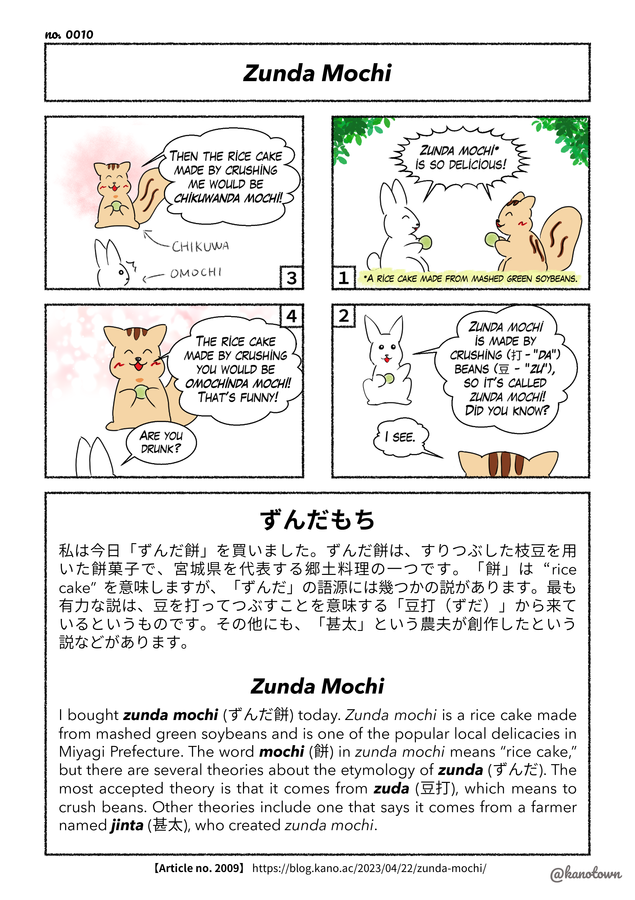

# English

## 【No. 0001】Etiquette of Exchanging Business Cards: Part 1

[https://blog.kano.ac/2023/05/02/etiquette-of-exchanging-business-cards-part-1/](https://blog.kano.ac/2023/05/02/etiquette-of-exchanging-business-cards-part-1/)

<figure markdown>
  { width="400" }
</figure>

## 【No. 0002】Etiquette of Exchanging Business Cards: Part 2

[https://blog.kano.ac/2023/05/03/etiquette-of-exchanging-business-cards-part-2/](https://blog.kano.ac/2023/05/03/etiquette-of-exchanging-business-cards-part-2/)

<figure markdown>
  { width="400" }
</figure>

## 【No. 0003】Wara ni mo Sugaru (Act of Desperation)

[https://blog.kano.ac/2021/07/08/wara-ni-mo-sugaru/](https://blog.kano.ac/2021/07/08/wara-ni-mo-sugaru/)

<figure markdown>
  { width="400" }
</figure>

## 【No. 0004】Kiite Gokuraku Mite Jigoku

[https://blog.kano.ac/2021/05/21/kiite-gokuraku-mite-jigoku/](https://blog.kano.ac/2021/05/21/kiite-gokuraku-mite-jigoku/)

<figure markdown>
  { width="400" }
</figure>

## 【No. 0005】Ping Pong Dash (Ding-dong Ditch)

[https://blog.kano.ac/2021/02/28/ping-pong-dash/](https://blog.kano.ac/2021/02/28/ping-pong-dash/)

<figure markdown>
  { width="400" }
</figure>

## 【No. 0006】Batsu ga Warui (Awkward/Uncomfortable)

[https://blog.kano.ac/2021/04/04/batsu-ga-warui/](https://blog.kano.ac/2021/04/04/batsu-ga-warui/)

<figure markdown>
  { width="400" }
</figure>

## 【No. 0007】Kata wo Kasu (Lending a Hand)

[https://blog.kano.ac/2021/06/30/kata-wo-kasu/](https://blog.kano.ac/2021/06/30/kata-wo-kasu/)

<figure markdown>
  { width="400" }
</figure>

## 【No. 0008】Me to Hana no Saki (Stone’s Throw)

[https://blog.kano.ac/2021/04/01/me-to-hana-no-saki/](https://blog.kano.ac/2021/04/01/me-to-hana-no-saki/)

<figure markdown>
  { width="400" }
</figure>

## 【No. 0009】Mago ni mo Ishō (Fine Feathers Make Fine Bird)

[https://blog.kano.ac/2023/05/06/mago-ni-mo-isho/](https://blog.kano.ac/2023/05/06/mago-ni-mo-isho/)

<figure markdown>
  { width="400" }
</figure>

## 【No. 0010】Zunda Mochi

[https://blog.kano.ac/2023/04/22/zunda-mochi/](https://blog.kano.ac/2023/04/22/zunda-mochi/)

<figure markdown>
  { width="400" }
</figure>

## 【No. 0011】Harapeko (Being Hungry)

[https://blog.kano.ac/2021/03/14/harapeko/](https://blog.kano.ac/2021/03/14/harapeko/)

<figure markdown>
  { width="400" }
</figure>

## 【No. 0012】Setogiwa / Yaki ga Mawaru

[https://blog.kano.ac/2017/07/01/setogiwa/](https://blog.kano.ac/2017/07/01/setogiwa/)
[https://blog.kano.ac/2019/04/26/yaki-ga-mawaru/](https://blog.kano.ac/2019/04/26/yaki-ga-mawaru/)

<figure markdown>
  { width="400" }
</figure>

 
