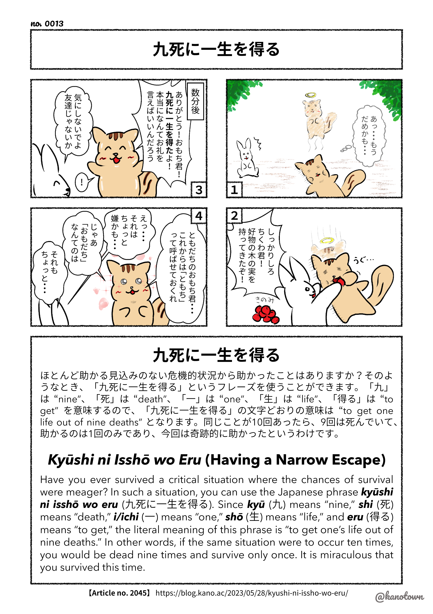

# Japanese

## 【No. 0001】名刺交換のマナー Part 1

[https://blog.kano.ac/2023/05/02/etiquette-of-exchanging-business-cards-part-1/](https://blog.kano.ac/2023/05/02/etiquette-of-exchanging-business-cards-part-1/)

<figure markdown>
  { width="400" }
</figure>

## 【No. 0002】名刺交換のマナー Part 2

[https://blog.kano.ac/2023/05/03/etiquette-of-exchanging-business-cards-part-2/](https://blog.kano.ac/2023/05/03/etiquette-of-exchanging-business-cards-part-2/)

<figure markdown>
  { width="400" }
</figure>

## 【No. 0003】わらにもすがる

[https://blog.kano.ac/2021/07/08/wara-ni-mo-sugaru/](https://blog.kano.ac/2021/07/08/wara-ni-mo-sugaru/)

<figure markdown>
  { width="400" }
</figure>

## 【No. 0004】聞いて極楽見て地獄

[https://blog.kano.ac/2021/05/21/kiite-gokuraku-mite-jigoku/](https://blog.kano.ac/2021/05/21/kiite-gokuraku-mite-jigoku/)

<figure markdown>
  { width="400" }
</figure>

## 【No. 0005】ピンポンダッシュ

[https://blog.kano.ac/2021/02/28/ping-pong-dash/](https://blog.kano.ac/2021/02/28/ping-pong-dash/)

<figure markdown>
  { width="400" }
</figure>

## 【No. 0006】ばつが悪い

[https://blog.kano.ac/2021/04/04/batsu-ga-warui/](https://blog.kano.ac/2021/04/04/batsu-ga-warui/)

<figure markdown>
  { width="400" }
</figure>

## 【No. 0007】肩を貸す

[https://blog.kano.ac/2021/06/30/kata-wo-kasu/](https://blog.kano.ac/2021/06/30/kata-wo-kasu/)

<figure markdown>
  { width="400" }
</figure>

## 【No. 0008】目と鼻の先

[https://blog.kano.ac/2021/04/01/me-to-hana-no-saki/](https://blog.kano.ac/2021/04/01/me-to-hana-no-saki/)

<figure markdown>
  { width="400" }
</figure>

## 【No. 0009】馬子にも衣装

[https://blog.kano.ac/2023/05/06/mago-ni-mo-isho/](https://blog.kano.ac/2023/05/06/mago-ni-mo-isho/)

<figure markdown>
  { width="400" }
</figure>

## 【No. 0010】ずんだもち

[https://blog.kano.ac/2023/04/22/zunda-mochi/](https://blog.kano.ac/2023/04/22/zunda-mochi/)

<figure markdown>
  { width="400" }
</figure>

## 【No. 0011】腹ぺこ

[https://blog.kano.ac/2021/03/14/harapeko/](https://blog.kano.ac/2021/03/14/harapeko/)

<figure markdown>
  { width="400" }
</figure>

## 【No. 0012】瀬戸際 / 焼きが回る

[https://blog.kano.ac/2017/07/01/setogiwa/](https://blog.kano.ac/2017/07/01/setogiwa/)
[https://blog.kano.ac/2019/04/26/yaki-ga-mawaru/](https://blog.kano.ac/2019/04/26/yaki-ga-mawaru/)

<figure markdown>
  { width="400" }
</figure>

## 【No. 0013】九死に一生を得る

[https://blog.kano.ac/2023/05/28/kyushi-ni-issho-wo-eru/](https://blog.kano.ac/2023/05/28/kyushi-ni-issho-wo-eru/)

<figure markdown>
  { width="400" }
</figure>

## 【No. 0014】尻尾を出す

[https://blog.kano.ac/2018/11/08/shippo-wo-dasu/](https://blog.kano.ac/2018/11/08/shippo-wo-dasu/)

<figure markdown>
  { width="400" }
</figure>

## 【No. 0015】恩を仇で返す

[https://blog.kano.ac/2019/04/08/on-wo-ada-de-kaesu/](https://blog.kano.ac/2019/04/08/on-wo-ada-de-kaesu/)

<figure markdown>
  { width="400" }
</figure>

## 【No. 0016】目がない

[https://blog.kano.ac/2018/11/01/me-ga-nai/](https://blog.kano.ac/2018/11/01/me-ga-nai/)

<figure markdown>
  { width="400" }
</figure>

## 【No. 0017】苦しい

[https://blog.kano.ac/2019/08/19/kurushi/](https://blog.kano.ac/2019/08/19/kurushi/)

<figure markdown>
  { width="400" }
</figure>

## 【No. 0018】弱り目に祟り目

[https://blog.kano.ac/2023/06/27/yowari-me-ni-tatari-me/](https://blog.kano.ac/2023/06/27/yowari-me-ni-tatari-me/)

<figure markdown>
  { width="400" }
</figure>

## 【No. 0019】空茶

[https://blog.kano.ac/2018/02/21/karacha/](https://blog.kano.ac/2018/02/21/karacha/)

<figure markdown>
  { width="400" }
</figure>

## 【No. 0020】身を焦がす

[https://blog.kano.ac/2023/06/07/mi-wo-kogasu/](https://blog.kano.ac/2023/06/07/mi-wo-kogasu/)

<figure markdown>
  { width="400" }
</figure>

## 【No. 0021】月が綺麗ですね

[https://blog.kano.ac/2016/07/21/tsuki-ga-kirei-desu-ne/](https://blog.kano.ac/2016/07/21/tsuki-ga-kirei-desu-ne/)

<figure markdown>
  { width="400" }
</figure>

## 【No. 0022】手前味噌

[https://blog.kano.ac/2019/03/05/temae-miso/](https://blog.kano.ac/2019/03/05/temae-miso/)

<figure markdown>
  { width="400" }
</figure>

## 【No. 0023】ひもじい

 
